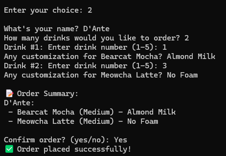
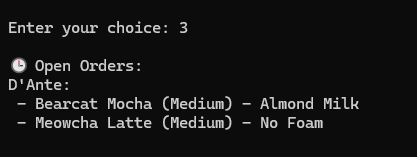

# Bistro Ordering System

## Data Structure Choices

| Component            | Data Structure | Justification                                                                |
|----------------------|----------------|----------------------------------------------------------------------------|
| Menu                 | Array          | Fixed list of 5 drinks, fast indexed access (O(1)).                        |
| Customer Order       | LinkedList     | Dynamic number of drinks per order, efficient appends (O(1)).              |
| Order Confirmation   | LinkedList     | Re-uses the order's LinkedList for iteration.                              |
| Open Orders Queue    | CircularQueue  | FIFO ordering needed for processing orders, fast enqueue/dequeue (O(1)).   |
| Completed Orders     | HashMap        | Fast updates and lookups of drinks sold and total revenue (O(1) average). |

---

## How to Run

Run `bistro.py` using:

```bash
python bistro.py
```
## Reflection

Throughout this project, I implemented a fully working drink ordering system for the Bistro using the data structures built earlier in the course: Array, LinkedList, CircularQueue, and HashMap.

One challenge I faced was ensuring that method names in the main program matched the implementations from previous assignments. For example, my `LinkedList` used `append` instead of `add_last`, and my `HashMap` used dictionary-style item assignment (`[...] = ...`) instead of a `.put()` method. Debugging these mismatches helped me better understand how to design systems that align with the data structure interfaces provided.

Another key learning was how to handle iteration correctly. My `HashMap` did not yield key-value pairs like a native Python dictionary, so I had to manually access values using the keys when generating reports.

If I had more time, I would add features like file saving and loading so that completed orders persist across sessions. I would also add estimated wait times for drinks and improve the user interface with better formatting or color to make it more user-friendly.

---

## Sample Run (Actual Output)

```plaintext
📋 Main Menu
1. Display Menu
2. Take New Order
3. View Open Orders
4. Mark Next Order as Complete
5. View End-of-Day Report
6. Exit

Enter your choice: 1

🍹 Bearcat Bistro Menu:
1. Bearcat Mocha - $4.50
2. Caramel Catpuccino - $4.25
3. Meowcha Latte - $4.75
4. Vanilla Purrccino - $4.00
5. Espresso Whisker Shot - $3.50

📋 Main Menu
Enter your choice: 2

What's your name? alex
How many drinks would you like to order? 2
Drink #1: Enter drink number (1-5): 1
Any customization for Bearcat Mocha? almond milk
Drink #2: Enter drink number (1-5): 4
Any customization for Vanilla Purrccino? less foam

📝 Order Summary:
alex:
 - Bearcat Mocha (Medium) - almond milk
 - Vanilla Purrccino (Medium) - less foam

Confirm order? (yes/no): yes
✅ Order placed successfully!

📋 Main Menu
Enter your choice: 3

🕒 Open Orders:
alex:
 - Bearcat Mocha (Medium) - almond milk
 - Vanilla Purrccino (Medium) - less foam

📋 Main Menu
Enter your choice: 4

✅ Completed Order for alex!

📋 Main Menu
Enter your choice: 5

📊 End-of-Day Report
----------------------------
Drink Name                Qty Sold   Total Sales
Vanilla Purrccino         1          $4.00
Bearcat Mocha             1          $4.50
Total Revenue: $8.50
Thanks for using Bearcat Bistro POS System! 🐾 Come back soon!

📋 Main Menu
Enter your choice: 6
Exiting... Have a great day!


## Screenshots *idk why its not displaying the images but i attached them*

### 1. Displaying the menu


### 2. Taking a new order


### 3. Viewing open orders


### 4. Marking an order complete


### 5. End-of-day report


